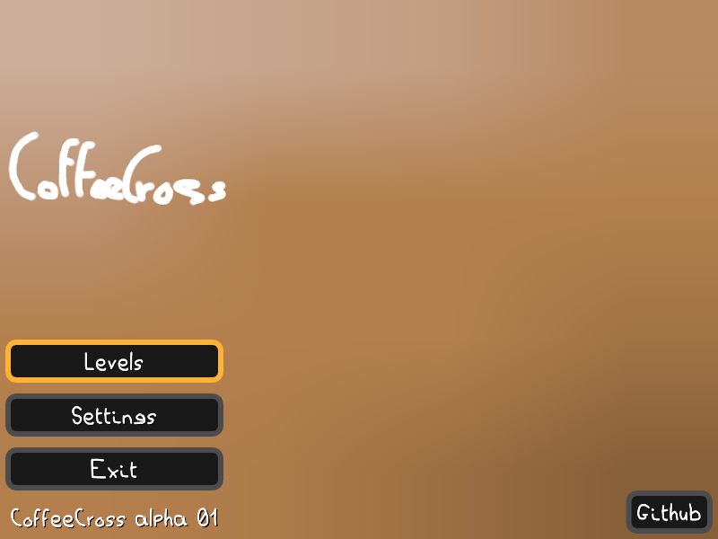
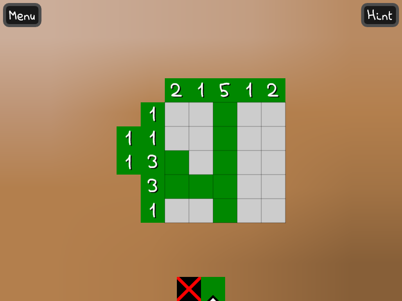
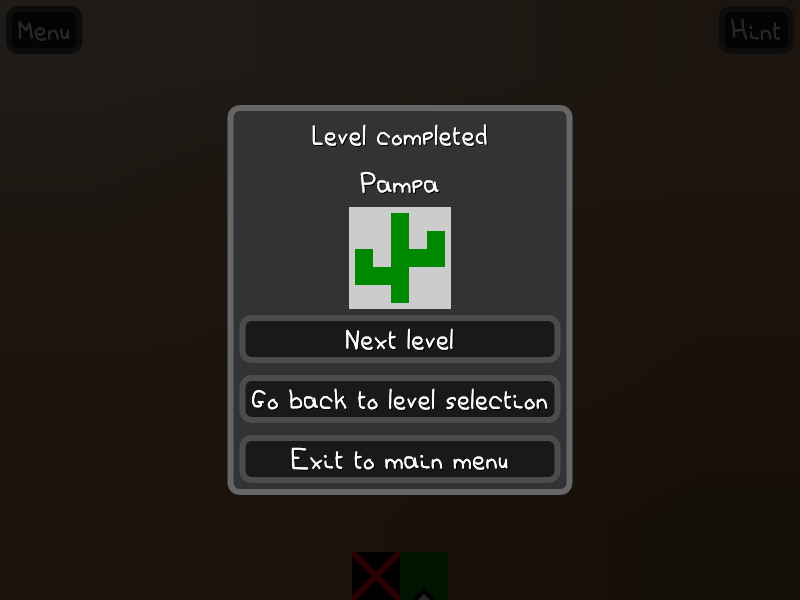

# CoffeeCross

CoffeeCross is an open-source GPL licensed picross game.

CoffeeCross is built using the LÖVE engine.

## Running CoffeeCross

You first need to install [LÖVE](https://love2d.org/wiki/Getting_Started).

Then you can simply run `love coffeecross`.

## Screenshots

